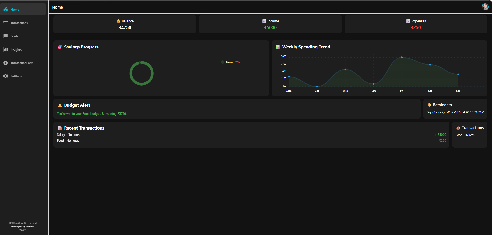
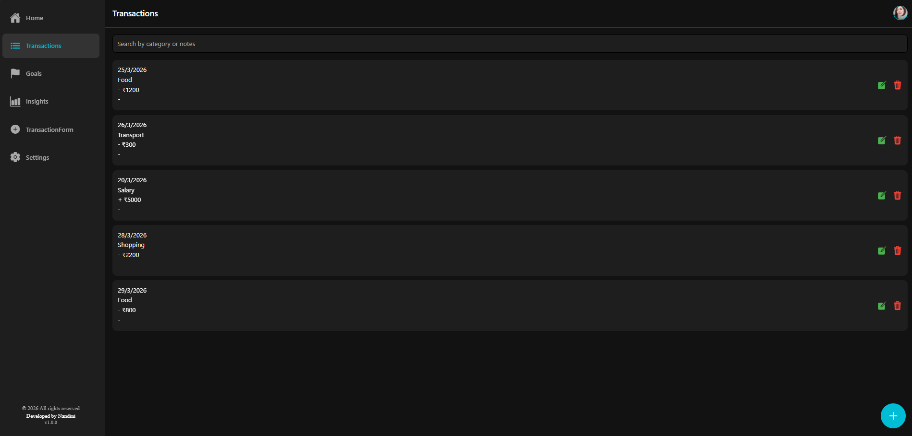
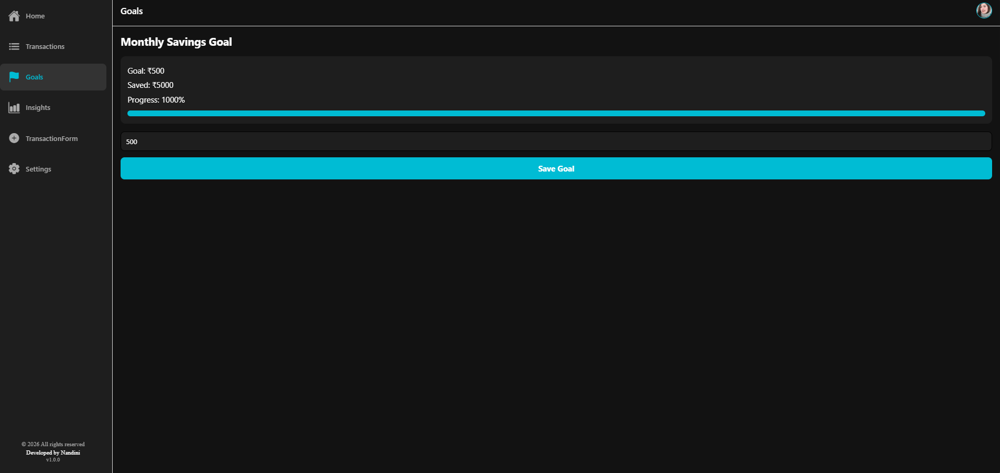
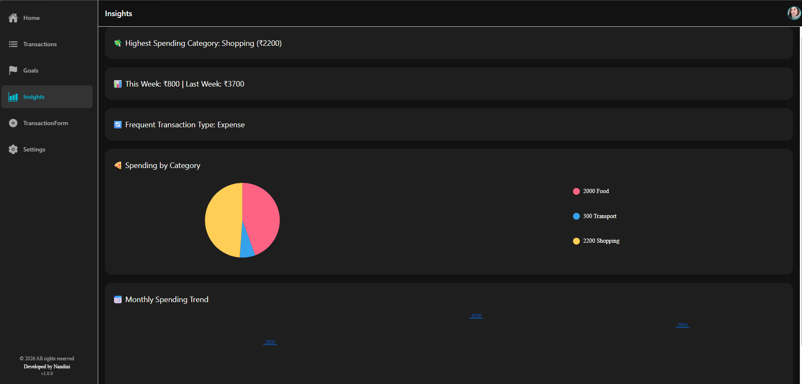
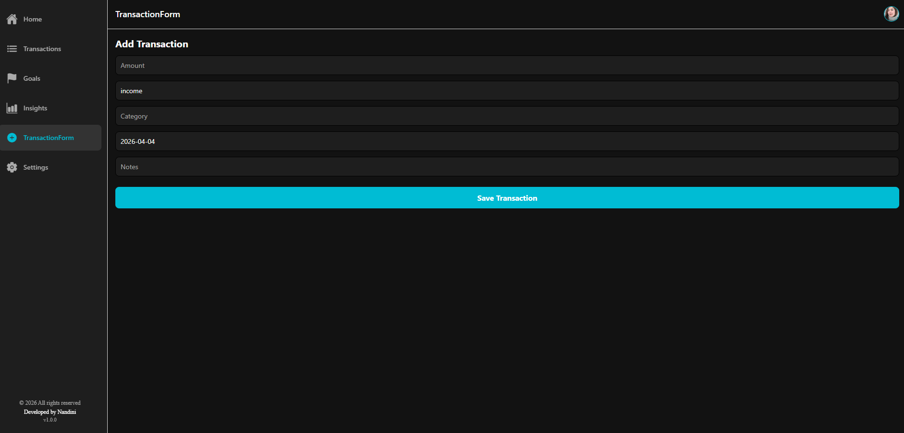
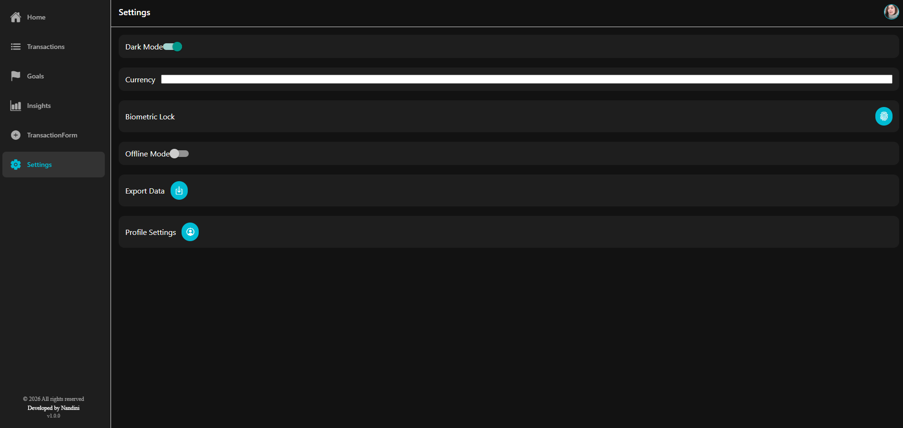

<<<<<<< HEAD
# 📱 Personal Finance Companion Mobile App

## 🔎 Quick Start
```bash
npm install
npx expo start

Open in Expo Go or an emulator to run the app instantly.

📖 Overview
The Personal Finance Companion is a React Native app designed to help users manage their finances with clarity and ease. It demonstrates skills in app structure, navigation, state handling, and polished UI/UX design.

🚀 Setup Instructions
- Clone the repo:
git clone https://github.com/your-repo/finance-companion.git
cd finance-companion
- Install dependencies:
npm install
- Run the app:
npx expo start

- Open in Expo Go.

📂 Project Structure
/context
  TransactionContext.js
  SettingsContext.js
/screens
  HomeScreen.js
  TransactionsScreen.js
  GoalsScreen.js
  InsightsScreen.js
  SettingsScreen.js
  ProfileScreen.js
/services
  exportService.js
/theme.js
Layout.js


🎨 Features
- Dashboard overview
- Transactions management
- Goals tracking
- Insights with charts
- Profile editing (name, email, notifications)
- Export transactions to CSV
- Login/Logout functionality
- Global navigation with bottom tabs and profile icon

🖼️ Screenshots

Dashboard

Transactions

Goals

Insights

TransactionFrm

Settings

ProfileSettings


📌 Assumptions
- Profile data stored locally (mock data).
- Export assumes transaction context.
- Login/logout simulated (no backend yet).
- Dark mode and currency preferences handled via SettingsContext.

⚠️ Known Issues
- Some deprecation warnings appear in React Native Web (do not affect mobile functionality).
- Direct browser route access may show 404; navigation works inside the app.
- Animations fall back to JS driver on web (smooth on mobile).


📈 Future Enhancements
- Persistent storage (AsyncStorage or database).
- Real authentication (Firebase/Supabase).
- Push notifications for reminders.
- Advanced charts and insights.
- Multi‑currency support.

 🧠 Thought Process

### App Structure
I wanted the app to feel organized and easy to maintain, so I split it into clear modules:
- **Context** handles global state like transactions, settings, and profile data.
- **Screens** represent each major feature (Home, Transactions, Goals, Insights, Settings, Profile).
- **Services** take care of tasks like exporting data.
- **Theme** ensures consistent colors, spacing, and typography across the app.

### State Handling
To keep things simple, profile data is stored locally and updated through context.  
SettingsContext manages dark mode and currency preferences, while login/logout is simulated with a toggle to demonstrate how authentication could work in a real app.

### UX Decisions
I focused on making the app intuitive:
- A profile icon in the header gives quick access to user settings.
- Save, Export, and Login/Logout buttons are placed prominently on the Profile screen.
- Notification preferences are controlled with toggle switches for clarity.
- Consistent spacing and typography make the interface easy to read.

### Design & Styling
The `theme.js` file centralizes all styling choices, so the app looks consistent.  
Buttons use primary, secondary, and error colors to clearly communicate intent, and layouts are designed to be responsive and user‑friendly.

### Professional Touch
I added a **Known Issues** section to acknowledge React Native Web warnings, documented assumptions to clarify scope, and suggested future enhancements to show forward‑thinking.  

Overall, my approach was not just about writing code — it was about **planning carefully, designing with the user in mind, and making sure the app feels polished and professional**.

🛠 Tech Stack
- Framework: React Native with Expo for rapid development and testing
- Navigation: React Navigation for tab and stack navigation
- State Management: Context API (TransactionContext, SettingsContext) for global state handling
- UI/UX: Custom theme.js for consistent styling, responsive layouts, and polished design
- Charts & Insights: react-native-chart-kit (github.com in Bing) for progress and trend visualizations
- Data Handling: Local mock data for profile and transactions; CSV export via exportService.js
- Authentication (Simulated): Simple login/logout toggle to demonstrate flow
- Platform Support: Mobile (iOS/Android) via Expo Go; limited web support with React Native Web


